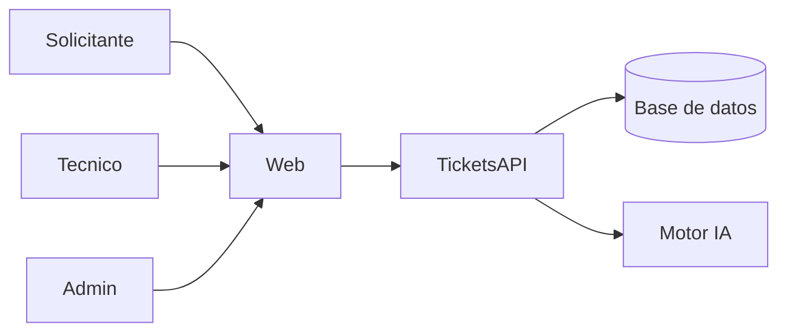

# incidenTI — Identificación del problema, requisitos e historias de usuario

Documento de análisis basado en el prototipo frontend (`web/`) y el backend [TicketsAPI](https://github.com/VidalLeonardoDeLosSantosRincon/TicketsAPI) (ASP.NET Core).

**Producto:** Plataforma inteligente de gestión de incidentes TI  
**Frontend:** Next.js — login, dashboard, tickets, detalle con panel IA, equipos  
**Backend:** API REST con autenticación JWT, tickets, equipos y usuarios  

---

## 1. Identificación del problema

### 1.1 Contexto de la organización o escenario

Se plantea el escenario de una organización mediana o grande con un área de Tecnologías de la Información (TI) responsable de atender incidentes reportados por usuarios internos: fallas de red, software, hardware, correo, accesos y seguridad.

Hoy el soporte se canaliza mediante tickets (mesa de ayuda / service desk). El volumen diario incluye desde consultas menores (impresora, acceso a carpetas) hasta incidentes críticos (caída de VPN, phishing, fallas de sistemas de negocio).

Los equipos de resolución están especializados —por ejemplo Helpdesk, Redes, Aplicaciones, Seguridad e Infraestructura— y cada incidente debe llegar al equipo correcto con una prioridad acorde al impacto.

El alcance del sistema **incidenTI** contempla:

- Un **portal web** para solicitantes, técnicos (agentes) y administradores.
- Una **API** que centraliza autenticación, tickets y equipos.
- Capacidad de **asistencia inteligente**: clasificación, priorización, sugerencias de solución y asignación, con intervención humana para confirmar o corregir.

### 1.2 Problema identificado

El triaje (clasificación, priorización y asignación) de incidentes TI es **lento, inconsistente y dependiente del criterio individual** del personal de primer nivel.

En la práctica:

1. Los tickets llegan con descripciones desiguales y poco estructuradas.
2. Un humano debe leer cada caso, decidir categoría, prioridad y equipo.
3. La reasignación por error de enrutamiento es frecuente.
4. El conocimiento de soluciones previas no se reutiliza de forma sistemática.
5. Los incidentes críticos pueden quedar en cola junto a solicitudes de baja urgencia.

### 1.3 Causas principales

| Causa | Descripción |
|-------|-------------|
| Triaje manual | Cada ticket requiere lectura y decisión humana antes de llegar al especialista. |
| Criterios no estandarizados | Distintos agentes aplican distintas nociones de “urgente” o “crítico”. |
| Conocimiento disperso | Soluciones de tickets resueltos viven en historiales o en la memoria del personal. |
| Falta de visibilidad operativa | Sin dashboard claro de abiertos, P1 y carga por equipo, la cola se gestiona a ciegas. |
| Canales y datos desalineados | Sin un modelo único (estados, prioridades, categorías), es difícil automatizar. |
| Herramientas genéricas | Portales de tickets sin asistencia de clasificación/sugerencias aumentan el trabajo repetitivo. |

### 1.4 Consecuencias del problema

- **Mayor tiempo medio de respuesta (MTTR)** y de primera atención.
- **Incidentes P1/P2 diluidos** entre tickets de baja prioridad.
- **Reasignaciones** entre equipos → retrasos y frustración del usuario.
- **Sobrecarga del Helpdesk** en tareas de lectura y clasificación.
- **Pérdida de aprendizaje organizacional**: se resuelve el mismo tipo de incidente varias veces sin reutilizar el historial.
- **Riesgo operativo y de seguridad** cuando phishing u outages no se escalan a tiempo.
- **Percepción negativa** del servicio de TI por parte del negocio.

### 1.5 Usuarios afectados

| Actor | Rol en el sistema | Cómo le afecta el problema |
|-------|-------------------|----------------------------|
| **Solicitante** | Empleado que reporta el incidente | Espera larga, respuestas genéricas, ticket mal enrutado. |
| **Técnico / Agente** | Resuelve o avanza tickets de su equipo | Pierde tiempo en triaje; recibe casos que no le corresponden. |
| **Administrador** | Configura equipos, usuarios y políticas | Dificultad para medir carga, SLAs y calidad del servicio. |
| **Líder de equipo TI** | Supervisa cola y priorización | Sin KPIs confiables (abiertos, P1, en progreso, resueltos). |
| **Organización / negocio** | Depende de sistemas TI | Interrupciones más largas y mayor costo de soporte. |

### 1.6 Necesidad de una solución tecnológica

Se requiere una solución que:

1. **Centralice** el ciclo de vida del ticket (crear → clasificar → asignar → resolver → cerrar).
2. **Estandarice** estados, prioridades (P1–P4) y categorías (red, hardware, software, acceso, correo, seguridad, otro).
3. **Asista con IA** en clasificación, prioridad, equipo destino y sugerencias de solución, manteniendo al humano en el loop.
4. **Ofrezca visibilidad** mediante dashboard y filtros (estado, prioridad, equipo).
5. **Separe responsabilidades** con autenticación y roles (Solicitante, Técnico, Admin).
6. **Exponga una API** consumible por el portal y, a futuro, por otros canales (email, Slack).

El prototipo `web/` valida la experiencia de usuario; [TicketsAPI](https://github.com/VidalLeonardoDeLosSantosRincon/TicketsAPI) aporta el contrato de datos y seguridad (JWT, equipos, tickets, resumen operativo) sobre el cual se construye la solución.

---

## 2. Análisis de requisitos

Convención de ID: `RF` funcional · `RNF` no funcional · `RS` seguridad · `RD` disponibilidad · `RR` rendimiento · `RU` usabilidad.

Cada requisito es verificable (prueba, inspección o medición).

### 2.1 Requisitos funcionales

| ID | Requisito | Prioridad | Verificación |
|----|-----------|-----------|--------------|
| RF-01 | El sistema deberá permitir autenticación de usuarios mediante correo y contraseña, devolviendo un token de acceso. | Alta | Login exitoso vía `POST /api/auth/token` y pantalla `/login`. |
| RF-02 | El sistema deberá restringir el acceso a tickets y equipos a usuarios autenticados con el alcance adecuado. | Alta | Llamadas sin token → 401; con token válido → 200. |
| RF-03 | El sistema deberá permitir crear un ticket con título y descripción (categoría/equipo opcionales). | Alta | Flujo `/tickets/new` y endpoint de creación (a completar en API). |
| RF-04 | El sistema deberá listar tickets con filtros por texto, estado, prioridad y equipo. | Alta | `/tickets` + `GET /api/tickets` con `TicketSearchFilter`. |
| RF-05 | El sistema deberá mostrar el detalle de un ticket: datos, estado, prioridad, categoría, equipo, asignado, fechas. | Alta | `/tickets/[id]` + `GET /api/tickets/{guid}`. |
| RF-06 | El sistema deberá gestionar el ciclo de estados: `new` → `classified` → `assigned` → `in_progress` → `resolved` → `closed`. | Alta | Transiciones visibles en UI y persistidas en API. |
| RF-07 | El sistema deberá soportar prioridades P1, P2, P3 y P4 con etiquetas de criticidad. | Alta | Badges en UI; enum `TicketPriorityEnum` en API. |
| RF-08 | El sistema deberá soportar categorías: network, hardware, software, access, email, security, other. | Alta | Badges/filtros en UI; enum `TicketCategoryEnum` en API. |
| RF-09 | El sistema deberá clasificar automáticamente (o asistir) categoría y prioridad, mostrando confianza y justificación. | Alta | Panel IA en detalle; modelo `TicketClassification`. |
| RF-10 | El sistema deberá sugerir soluciones con pasos, nivel de confianza y fuentes (tickets/KB). | Alta | Panel “Asistente IA”; entidades `SolutionSuggestion` / `SolutionSource`. |
| RF-11 | El sistema deberá asignar o proponer asignación al equipo correspondiente según la categoría/reglas. | Alta | Campo equipo en ticket; listado `GET /api/teams`. |
| RF-12 | El sistema deberá registrar una línea de tiempo de eventos del ticket. | Media | Timeline en detalle; entidad `TimelineEvent`. |
| RF-13 | El sistema deberá permitir al técnico aceptar, rechazar o corregir sugerencias de la IA (feedback). | Media | Acciones thumbs up/down y “Usar esta solución” en UI. |
| RF-14 | El sistema deberá mostrar un dashboard con KPIs: abiertos, P1, en progreso, resueltos, y actividad reciente. | Alta | `/` + `GET /api/tickets?summary=true` (`TicketSummaryDto`). |
| RF-15 | El sistema deberá listar equipos con nombre, descripción, slug, miembros y tickets abiertos. | Alta | `/teams` + `GET /api/teams`. |
| RF-16 | El sistema deberá permitir al administrador crear y editar equipos. | Media | Pantalla admin (pendiente en mock); endpoint POST/PUT (pendiente en API). |
| RF-17 | El sistema deberá diferenciar roles: Solicitante, Técnico y Admin, con permisos distintos. | Alta | Constantes `Roles` en API; menús/acciones condicionadas en UI. |
| RF-18 | El sistema deberá permitir acciones operativas sobre el ticket (tomar, cambiar prioridad, reasignar, marcar resuelto). | Media | Botones en detalle; endpoints de actualización (a implementar). |
| RF-19 | El sistema deberá exponer documentación interactiva de la API (Swagger) en desarrollo. | Baja | Swagger UI en perfil Development del API. |

### 2.2 Requisitos no funcionales (generales)

| ID | Requisito | Verificación |
|----|-----------|--------------|
| RNF-01 | La arquitectura se separará en cliente web y API REST, permitiendo evolución independiente. | Repos `web/` e TicketsAPI; contratos JSON. |
| RNF-02 | El frontend utilizará una interfaz corporativa (modo claro, tipografía y colores empresariales). | Inspección de `/` y design tokens navy/slate. |
| RNF-03 | El backend seguirá una arquitectura en capas (Domain, Application, Infrastructure, API). | Estructura de proyectos TicketsAPI. |
| RNF-04 | Los datos de tickets, usuarios y equipos se persistirán en base de datos relacional. | `AppDbContext` + connection string `TicketsDB`. |
| RNF-05 | El código y la documentación del análisis estarán versionados en repositorio Git. | Repos públicos/privados del equipo. |

### 2.3 Requisitos de seguridad

| ID | Requisito | Verificación |
|----|-----------|--------------|
| RS-01 | Toda operación sobre tickets/equipos (excepto login) requerirá JWT Bearer válido. | `[Authorize]` en controladores; prueba sin token. |
| RS-02 | El token deberá validar emisor, audiencia, firma y expiración. | Configuración `JwtBearer` en `Program.cs`. |
| RS-03 | El acceso a recursos de tickets deberá exigir el claim/scope de autorización definido. | Policy `GrantTicketAccess`. |
| RS-04 | Las contraseñas no deberán almacenarse ni transmitirse en claro en logs o respuestas. | Revisión de DTOs de respuesta (`LoginResponseDto` sin password). |
| RS-05 | CORS deberá limitar orígenes permitidos al frontend autorizado (p. ej. `localhost:3000` en desarrollo). | Política CORS en `Program.cs`. |
| RS-06 | Secretos (JWT, connection strings) no deberán versionarse en repositorio. | `appsettings` con valores vacíos; uso de secretos/entorno. |
| RS-07 | Los roles limitarán acciones administrativas (p. ej. gestión de equipos) al perfil Admin. | Pruebas de autorización por rol. |

### 2.4 Requisitos de disponibilidad

| ID | Requisito | Verificación |
|----|-----------|--------------|
| RD-01 | En horario laboral, el portal y la API deberán estar disponibles para registrar y consultar tickets. | Monitoreo / uptime del entorno desplegado. |
| RD-02 | Una caída de la asistencia IA no deberá impedir crear ni consultar tickets (degradación controlada). | Fallback a triaje manual si el motor IA falla. |
| RD-03 | El sistema deberá informar errores de autenticación o recurso no encontrado de forma controlada (401, 404). | Respuestas tipadas del API. |

### 2.5 Requisitos de rendimiento

| ID | Requisito | Verificación |
|----|-----------|--------------|
| RR-01 | El listado de tickets (hasta 100 registros de prueba) deberá renderizarse en el portal en menos de 3 s en red local. | Medición en navegador. |
| RR-02 | El resumen del dashboard (`summary=true`) deberá responder en menos de 2 s en entorno de desarrollo local. | Medición de latencia HTTP. |
| RR-03 | La clasificación/sugerencia asistida por IA, cuando exista, deberá completarse en menos de 15 s para un ticket nuevo (objetivo MVP). | Cronometraje del pipeline. |
| RR-04 | Las consultas de listado deberán soportar paginación (`CurrentPage`, `PageSize`) para no degradar con el crecimiento del histórico. | Uso de `TicketSearchFilter`. |

### 2.6 Requisitos de usabilidad

| ID | Requisito | Verificación |
|----|-----------|--------------|
| RU-01 | Un solicitante deberá poder crear un ticket en no más de 3 pasos visibles (título, descripción, enviar). | Recorrido `/tickets/new`. |
| RU-02 | Prioridad y estado deberán identificarse visualmente con badges consistentes. | Inspección de lista y detalle. |
| RU-03 | El técnico deberá ver en una sola pantalla del detalle: datos del ticket, timeline y sugerencias IA. | Layout de `/tickets/[id]`. |
| RU-04 | La navegación principal (Dashboard, Tickets, Nuevo ticket, Equipos) deberá estar siempre accesible desde la barra lateral. | App shell del mock. |
| RU-05 | Los textos de interfaz estarán en español, claros y orientados a personal no técnico (solicitante) y técnico. | Revisión de copy en pantallas. |
| RU-06 | La interfaz deberá ser usable en escritorio y adaptable a anchos menores (responsive básico). | Prueba en viewport móvil/desktop. |
| RU-07 | El login deberá comunicar el propósito del producto y permitir acceso demo de forma evidente. | Pantalla `/login`. |

---

## 3. Historias de usuario y casos de uso

### 3.1 Actores

| Actor | Descripción | Sistema externo |
|-------|-------------|-----------------|
| **Solicitante** | Empleado que reporta incidentes y consulta el estado de sus tickets. | — |
| **Técnico** | Agente de un equipo de resolución; clasifica, atiende y resuelve. | — |
| **Administrador** | Configura equipos/usuarios y supervisa la operación. | — |
| **Motor IA** *(sistema)* | Componente que clasifica, prioriza y sugiere soluciones. | Modelo LLM / reglas |
| **TicketsAPI** *(sistema)* | Backend que autentica y persiste tickets/equipos. | SQL Server |

### 3.2 Historias de usuario

Formato: *Como [actor], quiero [acción] para [beneficio].*

#### Epic A — Acceso

| ID | Historia | Prioridad |
|----|----------|-----------|
| HU-01 | Como **usuario**, quiero iniciar sesión con correo y contraseña para acceder a la plataforma de forma segura. | Alta |
| HU-02 | Como **usuario autenticado**, quiero cerrar sesión para proteger mi cuenta en equipos compartidos. | Media |

#### Epic B — Gestión de tickets

| ID | Historia | Prioridad |
|----|----------|-----------|
| HU-03 | Como **solicitante**, quiero crear un ticket con título y descripción para reportar un incidente. | Alta |
| HU-04 | Como **técnico**, quiero ver la lista de tickets filtrada por estado, prioridad y equipo para enfocar mi trabajo. | Alta |
| HU-05 | Como **técnico**, quiero abrir el detalle de un ticket para conocer contexto, asignación y historial. | Alta |
| HU-06 | Como **técnico**, quiero marcar un ticket en progreso o resuelto para reflejar el avance real. | Alta |
| HU-07 | Como **técnico**, quiero reasignar un ticket a otro equipo cuando el enrutamiento inicial sea incorrecto. | Media |

#### Epic C — Asistencia inteligente

| ID | Historia | Prioridad |
|----|----------|-----------|
| HU-08 | Como **técnico**, quiero que el sistema proponga categoría y prioridad al crear el ticket para reducir el tiempo de triaje. | Alta |
| HU-09 | Como **técnico**, quiero ver sugerencias de solución con pasos y fuentes para resolver más rápido. | Alta |
| HU-10 | Como **técnico**, quiero aceptar o rechazar una sugerencia de la IA para mejorar futuras recomendaciones. | Media |
| HU-11 | Como **sistema**, quiero asignar automáticamente al equipo según la categoría cuando la confianza sea alta, para acelerar la atención. | Alta |

#### Epic D — Visibilidad y administración

| ID | Historia | Prioridad |
|----|----------|-----------|
| HU-12 | Como **líder/admin**, quiero ver un dashboard con abiertos, P1, en progreso y resueltos para tomar decisiones operativas. | Alta |
| HU-13 | Como **admin**, quiero listar los equipos de resolución y su carga para entender la distribución del trabajo. | Alta |
| HU-14 | Como **admin**, quiero crear y editar equipos para mantener actualizada la estructura de soporte. | Media |

### 3.3 Casos de uso

#### CU-01 — Iniciar sesión

| Campo | Contenido |
|-------|-----------|
| **Actor primario** | Solicitante / Técnico / Admin |
| **Precondiciones** | El usuario tiene credenciales válidas. |
| **Disparador** | Accede a `/login` e ingresa correo y contraseña. |
| **Flujo principal** | 1. Usuario envía credenciales. 2. Web llama `POST /api/auth/token`. 3. API valida y devuelve JWT + datos de usuario. 4. Web almacena el token y redirige al dashboard. |
| **Flujos alternos** | A1. Credenciales inválidas → 401 y mensaje de error. A2. Datos incompletos → 400. |
| **Postcondiciones** | Sesión autenticada; rutas protegidas accesibles. |

#### CU-02 — Crear ticket

| Campo | Contenido |
|-------|-----------|
| **Actor primario** | Solicitante (también Técnico) |
| **Precondiciones** | Usuario autenticado. |
| **Disparador** | Selecciona “Nuevo ticket”. |
| **Flujo principal** | 1. Completa título y descripción. 2. Opcionalmente indica categoría/equipo. 3. Envía el formulario. 4. El sistema registra el ticket en estado `new`. 5. Se dispara clasificación/priorización/asignación asistida. 6. El usuario es llevado al detalle. |
| **Flujos alternos** | A1. Campos obligatorios vacíos → validación en UI. A2. Falla de IA → ticket queda creado para triaje manual. |
| **Postcondiciones** | Ticket persistido; aparece en listados y dashboard. |

#### CU-03 — Consultar y filtrar tickets

| Campo | Contenido |
|-------|-----------|
| **Actor primario** | Técnico / Admin |
| **Precondiciones** | Usuario autenticado con permiso de tickets. |
| **Disparador** | Abre `/tickets`. |
| **Flujo principal** | 1. Sistema carga tickets (`GET /api/tickets`). 2. Usuario aplica filtros (texto, estado, prioridad, equipo). 3. La lista se actualiza. 4. Usuario selecciona un ticket. |
| **Postcondiciones** | Usuario visualiza la cola filtrada. |

#### CU-04 — Revisar detalle y asistencia IA

| Campo | Contenido |
|-------|-----------|
| **Actor primario** | Técnico |
| **Precondiciones** | Existe un ticket; usuario autenticado. |
| **Disparador** | Abre `/tickets/{id}`. |
| **Flujo principal** | 1. Se muestran datos, badges y metadatos. 2. Se muestra timeline. 3. Panel IA presenta confianza, rationale y sugerencias. 4. Técnico puede usar/aceptar/rechazar sugerencia o tomar el ticket. |
| **Flujos alternos** | A1. Ticket inexistente → 404. A2. Sin sugerencias → mensaje vacío en panel. |
| **Postcondiciones** | Técnico informado para actuar; feedback opcional registrado. |

#### CU-05 — Consultar resumen operativo (dashboard)

| Campo | Contenido |
|-------|-----------|
| **Actor primario** | Técnico / Admin / Líder |
| **Precondiciones** | Usuario autenticado. |
| **Disparador** | Abre `/`. |
| **Flujo principal** | 1. Web solicita resumen (`GET /api/tickets?summary=true`). 2. Se muestran KPIs y actividad reciente. 3. Usuario puede navegar a un ticket o crear uno nuevo. |
| **Postcondiciones** | Visibilidad del estado de la cola. |

#### CU-06 — Consultar equipos

| Campo | Contenido |
|-------|-----------|
| **Actor primario** | Admin / Técnico |
| **Precondiciones** | Usuario autenticado. |
| **Disparador** | Abre `/teams`. |
| **Flujo principal** | 1. Web llama `GET /api/teams`. 2. Se listan equipos con miembros y tickets abiertos. |
| **Postcondiciones** | Información de estructura de soporte disponible. |

#### CU-07 — Gestionar equipos *(objetivo admin)*

| Campo | Contenido |
|-------|-----------|
| **Actor primario** | Administrador |
| **Precondiciones** | Usuario con rol Admin. |
| **Disparador** | Desde `/teams`, elige crear o editar equipo. |
| **Flujo principal** | 1. Completa nombre, slug y descripción. 2. Guarda. 3. El equipo queda disponible para asignación de tickets. |
| **Estado actual** | Listado en mock; creación pendiente en UI y API. |
| **Postcondiciones** | Catálogo de equipos actualizado. |

### 3.4 Criterios de aceptación (por historia clave)

#### HU-01 — Login

- [ ] Dado un usuario válido, cuando envía correo y contraseña, entonces recibe un token y accede al dashboard.
- [ ] Dado un usuario inválido, cuando intenta autenticarse, entonces ve un error y no accede a rutas protegidas.
- [ ] El token se envía en las peticiones posteriores como `Authorization: Bearer …`.

#### HU-03 — Crear ticket

- [ ] El formulario exige título y descripción.
- [ ] Al enviar, el ticket aparece en la lista con estado inicial `new` (o el siguiente estado tras clasificación).
- [ ] El usuario puede llegar al detalle del ticket creado.

#### HU-04 — Filtrar tickets

- [ ] Los filtros de estado, prioridad y equipo reducen el conjunto visible.
- [ ] La búsqueda por texto coincide con título, número o solicitante.
- [ ] Si no hay resultados, se muestra un mensaje claro.

#### HU-05 / HU-09 — Detalle y sugerencias

- [ ] El detalle muestra prioridad, estado, categoría, equipo y asignado.
- [ ] El panel IA muestra confianza y al menos una sugerencia cuando existen datos.
- [ ] Cada sugerencia lista pasos numerados y fuentes.

#### HU-12 — Dashboard

- [ ] Se muestran contadores de abiertos, P1, en progreso y resueltos.
- [ ] La tabla de actividad reciente enlaza al detalle del ticket.
- [ ] Los valores pueden obtenerse desde `TicketSummaryDto` cuando la API está conectada.

#### HU-13 / HU-14 — Equipos

- [ ] El listado muestra nombre, descripción, slug, miembros y tickets abiertos.
- [ ] *(HU-14)* Solo Admin puede crear/editar; Técnico solo consulta.
- [ ] *(HU-14)* Tras crear un equipo, aparece en el listado y en los selectores de asignación.

#### HU-08 / HU-11 — Clasificación y asignación asistida

- [ ] Tras crear un ticket, el sistema propone categoría y prioridad con nivel de confianza.
- [ ] Si la confianza supera el umbral configurado, se asigna equipo automáticamente; si no, queda pendiente de revisión humana.
- [ ] El técnico puede corregir categoría, prioridad o equipo.

---

## 4. Trazabilidad rápida (mock ↔ API ↔ requisitos)

| Capacidad | Pantalla mock | API actual | Requisitos |
|-----------|---------------|------------|------------|
| Login | `/login` | `POST /api/auth/token` | RF-01, RS-01, HU-01, CU-01 |
| Dashboard | `/` | `GET /api/tickets?summary=true` | RF-14, HU-12, CU-05 |
| Lista tickets | `/tickets` | `GET /api/tickets` | RF-04, HU-04, CU-03 |
| Nuevo ticket | `/tickets/new` | Pendiente POST | RF-03, HU-03, CU-02 |
| Detalle + IA | `/tickets/[id]` | `GET /api/tickets/{guid}` (IA parcial en dominio) | RF-05, RF-09–13, HU-05/09, CU-04 |
| Equipos | `/teams` | `GET /api/teams` | RF-15–16, HU-13/14, CU-06/07 |

---

## 5. Referencias

- Prototipo frontend: carpeta `web/` del repositorio incidenTI  
- Guía técnica: [`implementation-guide.md`](./implementation-guide.md)  
- Backend: [VidalLeonardoDeLosSantosRincon/TicketsAPI](https://github.com/VidalLeonardoDeLosSantosRincon/TicketsAPI)  

---

*Documento elaborado para el análisis académico del proyecto. Debe actualizarse cuando se implementen creación de tickets/equipos, pipeline IA completo y despliegue en producción.*
