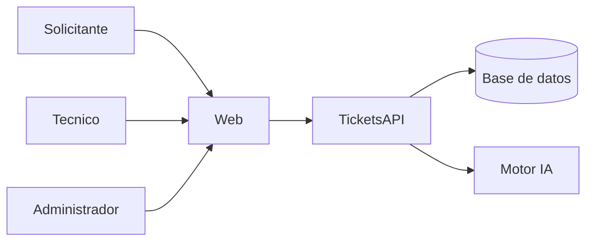
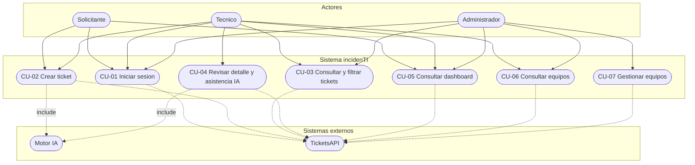
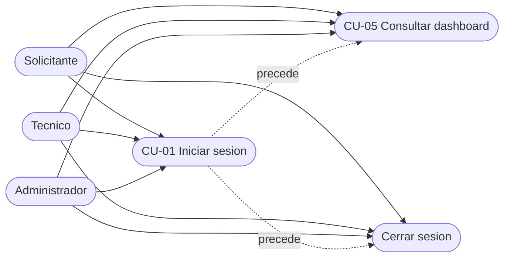
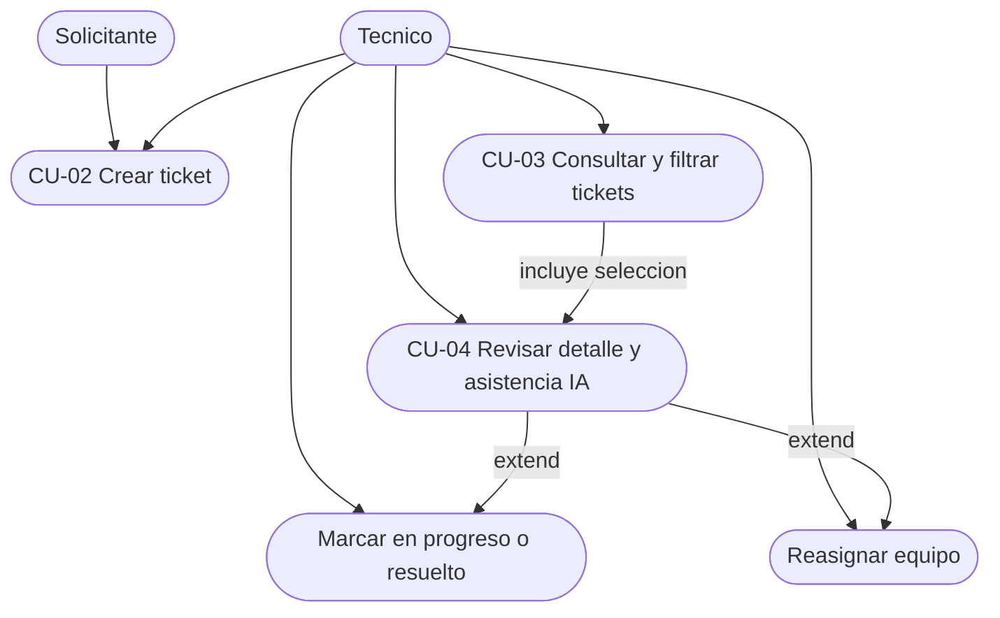
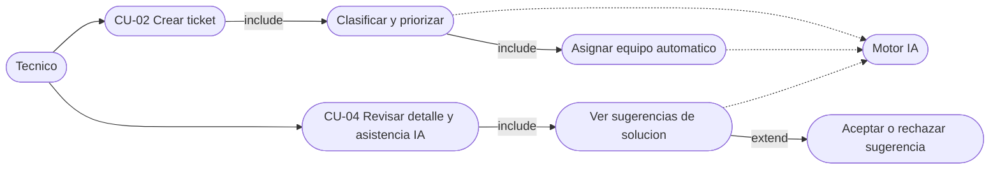
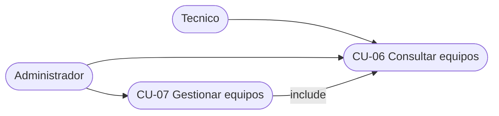

# incidenTI — Identificación del problema, requisitos e historias de usuario

Documento de análisis basado en el prototipo frontend (`web/`) y el backend [TicketsAPI](https://github.com/VidalLeonardoDeLosSantosRincon/TicketsAPI) (ASP.NET Core).

**Producto:** Plataforma inteligente de gestión de incidentes TI  
**Frontend:** Next.js — login, dashboard, tickets, detalle con panel IA, equipos  
**Backend:** API REST con autenticación JWT, tickets, equipos y usuarios  

---

## 1. Identificación del problema

### 1.1 Contexto de la organización o escenario

Se plantea el escenario de una organización mediana o grande con un área de Tecnologías de la Información (TI) responsable de atender incidentes reportados por usuarios internos: fallas de red, software, hardware, correo, accesos y seguridad.

Hoy el soporte se canaliza mediante tickets (mesa de ayuda / service desk). El volumen diario incluye desde consultas menores (impresora, acceso a carpetas) hasta incidentes críticos (caída de VPN, phishing, fallas de sistemas de negocio).

Los equipos de resolución están especializados —por ejemplo Helpdesk, Redes, Aplicaciones, Seguridad e Infraestructura— y cada incidente debe llegar al equipo correcto con una prioridad acorde al impacto.

El alcance del sistema **incidenTI** contempla:

- Un **portal web** para solicitantes, técnicos (agentes) y administradores.
- Una **API** que centraliza autenticación, tickets y equipos.
- Capacidad de **asistencia inteligente**: clasificación, priorización, sugerencias de solución y asignación, con intervención humana para confirmar o corregir.

### 1.2 Problema identificado

El triaje (clasificación, priorización y asignación) de incidentes TI es **lento, inconsistente y dependiente del criterio individual** del personal de primer nivel.

En la práctica:

1. Los tickets llegan con descripciones desiguales y poco estructuradas.
2. Un humano debe leer cada caso, decidir categoría, prioridad y equipo.
3. La reasignación por error de enrutamiento es frecuente.
4. El conocimiento de soluciones previas no se reutiliza de forma sistemática.
5. Los incidentes críticos pueden quedar en cola junto a solicitudes de baja urgencia.

### 1.3 Causas principales

| Causa | Descripción |
|-------|-------------|
| Triaje manual | Cada ticket requiere lectura y decisión humana antes de llegar al especialista. |
| Criterios no estandarizados | Distintos agentes aplican distintas nociones de “urgente” o “crítico”. |
| Conocimiento disperso | Soluciones de tickets resueltos viven en historiales o en la memoria del personal. |
| Falta de visibilidad operativa | Sin dashboard claro de abiertos, P1 y carga por equipo, la cola se gestiona a ciegas. |
| Canales y datos desalineados | Sin un modelo único (estados, prioridades, categorías), es difícil automatizar. |
| Herramientas genéricas | Portales de tickets sin asistencia de clasificación/sugerencias aumentan el trabajo repetitivo. |

### 1.4 Consecuencias del problema

- **Mayor tiempo medio de respuesta (MTTR)** y de primera atención.
- **Incidentes P1/P2 diluidos** entre tickets de baja prioridad.
- **Reasignaciones** entre equipos → retrasos y frustración del usuario.
- **Sobrecarga del Helpdesk** en tareas de lectura y clasificación.
- **Pérdida de aprendizaje organizacional**: se resuelve el mismo tipo de incidente varias veces sin reutilizar el historial.
- **Riesgo operativo y de seguridad** cuando phishing u outages no se escalan a tiempo.
- **Percepción negativa** del servicio de TI por parte del negocio.

### 1.5 Usuarios afectados

| Actor | Rol en el sistema | Cómo le afecta el problema |
|-------|-------------------|----------------------------|
| **Solicitante** | Empleado que reporta el incidente | Espera larga, respuestas genéricas, ticket mal enrutado. |
| **Técnico / Agente** | Resuelve o avanza tickets de su equipo | Pierde tiempo en triaje; recibe casos que no le corresponden. |
| **Administrador** | Configura equipos, usuarios y políticas | Dificultad para medir carga, SLAs y calidad del servicio. |
| **Líder de equipo TI** | Supervisa cola y priorización | Sin KPIs confiables (abiertos, P1, en progreso, resueltos). |
| **Organización / negocio** | Depende de sistemas TI | Interrupciones más largas y mayor costo de soporte. |

### 1.6 Necesidad de una solución tecnológica

Se requiere una solución que:

1. **Centralice** el ciclo de vida del ticket (crear → clasificar → asignar → resolver → cerrar).
2. **Estandarice** estados, prioridades (P1–P4) y categorías (red, hardware, software, acceso, correo, seguridad, otro).
3. **Asista con IA** en clasificación, prioridad, equipo destino y sugerencias de solución, manteniendo al humano en el loop.
4. **Ofrezca visibilidad** mediante dashboard y filtros (estado, prioridad, equipo).
5. **Separe responsabilidades** con autenticación y roles (Solicitante, Técnico, Admin).
6. **Exponga una API** consumible por el portal y, a futuro, por otros canales (email, Slack).

El prototipo `web/` valida la experiencia de usuario; [TicketsAPI](https://github.com/VidalLeonardoDeLosSantosRincon/TicketsAPI) aporta el contrato de datos y seguridad (JWT, equipos, tickets, resumen operativo) sobre el cual se construye la solución.

---

## 2. Análisis de requisitos

Convención de ID: `RF` funcional · `RNF` no funcional · `RS` seguridad · `RD` disponibilidad · `RR` rendimiento · `RU` usabilidad.

Cada requisito es verificable (prueba, inspección o medición).

### 2.1 Requisitos funcionales

| ID | Requisito | Prioridad | Verificación |
|----|-----------|-----------|--------------|
| RF-01 | El sistema deberá permitir autenticación de usuarios mediante correo y contraseña, devolviendo un token de acceso. | Alta | Login exitoso vía `POST /api/auth/token` y pantalla `/login`. |
| RF-02 | El sistema deberá restringir el acceso a tickets y equipos a usuarios autenticados con el alcance adecuado. | Alta | Llamadas sin token → 401; con token válido → 200. |
| RF-03 | El sistema deberá permitir crear un ticket con título y descripción (categoría/equipo opcionales). | Alta | Flujo `/tickets/new` y endpoint de creación (a completar en API). |
| RF-04 | El sistema deberá listar tickets con filtros por texto, estado, prioridad y equipo. | Alta | `/tickets` + `GET /api/tickets` con `TicketSearchFilter`. |
| RF-05 | El sistema deberá mostrar el detalle de un ticket: datos, estado, prioridad, categoría, equipo, asignado, fechas. | Alta | `/tickets/[id]` + `GET /api/tickets/{guid}`. |
| RF-06 | El sistema deberá gestionar el ciclo de estados: `new` → `classified` → `assigned` → `in_progress` → `resolved` → `closed`. | Alta | Transiciones visibles en UI y persistidas en API. |
| RF-07 | El sistema deberá soportar prioridades P1, P2, P3 y P4 con etiquetas de criticidad. | Alta | Badges en UI; enum `TicketPriorityEnum` en API. |
| RF-08 | El sistema deberá soportar categorías: network, hardware, software, access, email, security, other. | Alta | Badges/filtros en UI; enum `TicketCategoryEnum` en API. |
| RF-09 | El sistema deberá clasificar automáticamente (o asistir) categoría y prioridad, mostrando confianza y justificación. | Alta | Panel IA en detalle; modelo `TicketClassification`. |
| RF-10 | El sistema deberá sugerir soluciones con pasos, nivel de confianza y fuentes (tickets/KB). | Alta | Panel “Asistente IA”; entidades `SolutionSuggestion` / `SolutionSource`. |
| RF-11 | El sistema deberá asignar o proponer asignación al equipo correspondiente según la categoría/reglas. | Alta | Campo equipo en ticket; listado `GET /api/teams`. |
| RF-12 | El sistema deberá registrar una línea de tiempo de eventos del ticket. | Media | Timeline en detalle; entidad `TimelineEvent`. |
| RF-13 | El sistema deberá permitir al técnico aceptar, rechazar o corregir sugerencias de la IA (feedback). | Media | Acciones thumbs up/down y “Usar esta solución” en UI. |
| RF-14 | El sistema deberá mostrar un dashboard con KPIs: abiertos, P1, en progreso, resueltos, y actividad reciente. | Alta | `/` + `GET /api/tickets?summary=true` (`TicketSummaryDto`). |
| RF-15 | El sistema deberá listar equipos con nombre, descripción, slug, miembros y tickets abiertos. | Alta | `/teams` + `GET /api/teams`. |
| RF-16 | El sistema deberá permitir al administrador crear y editar equipos. | Media | Pantalla admin (pendiente en mock); endpoint POST/PUT (pendiente en API). |
| RF-17 | El sistema deberá diferenciar roles: Solicitante, Técnico y Admin, con permisos distintos. | Alta | Constantes `Roles` en API; menús/acciones condicionadas en UI. |
| RF-18 | El sistema deberá permitir acciones operativas sobre el ticket (tomar, cambiar prioridad, reasignar, marcar resuelto). | Media | Botones en detalle; endpoints de actualización (a implementar). |
| RF-19 | El sistema deberá exponer documentación interactiva de la API (Swagger) en desarrollo. | Baja | Swagger UI en perfil Development del API. |

### 2.2 Requisitos no funcionales (generales)

| ID | Requisito | Verificación |
|----|-----------|--------------|
| RNF-01 | La arquitectura se separará en cliente web y API REST, permitiendo evolución independiente. | Repos `web/` e TicketsAPI; contratos JSON. |
| RNF-02 | El frontend utilizará una interfaz corporativa (modo claro, tipografía y colores empresariales). | Inspección de `/` y design tokens navy/slate. |
| RNF-03 | El backend seguirá una arquitectura en capas (Domain, Application, Infrastructure, API). | Estructura de proyectos TicketsAPI. |
| RNF-04 | Los datos de tickets, usuarios y equipos se persistirán en base de datos relacional. | `AppDbContext` + connection string `TicketsDB`. |
| RNF-05 | El código y la documentación del análisis estarán versionados en repositorio Git. | Repos públicos/privados del equipo. |

### 2.3 Requisitos de seguridad

| ID | Requisito | Verificación |
|----|-----------|--------------|
| RS-01 | Toda operación sobre tickets/equipos (excepto login) requerirá JWT Bearer válido. | `[Authorize]` en controladores; prueba sin token. |
| RS-02 | El token deberá validar emisor, audiencia, firma y expiración. | Configuración `JwtBearer` en `Program.cs`. |
| RS-03 | El acceso a recursos de tickets deberá exigir el claim/scope de autorización definido. | Policy `GrantTicketAccess`. |
| RS-04 | Las contraseñas no deberán almacenarse ni transmitirse en claro en logs o respuestas. | Revisión de DTOs de respuesta (`LoginResponseDto` sin password). |
| RS-05 | CORS deberá limitar orígenes permitidos al frontend autorizado (p. ej. `localhost:3000` en desarrollo). | Política CORS en `Program.cs`. |
| RS-06 | Secretos (JWT, connection strings) no deberán versionarse en repositorio. | `appsettings` con valores vacíos; uso de secretos/entorno. |
| RS-07 | Los roles limitarán acciones administrativas (p. ej. gestión de equipos) al perfil Admin. | Pruebas de autorización por rol. |

### 2.4 Requisitos de disponibilidad

| ID | Requisito | Verificación |
|----|-----------|--------------|
| RD-01 | En horario laboral, el portal y la API deberán estar disponibles para registrar y consultar tickets. | Monitoreo / uptime del entorno desplegado. |
| RD-02 | Una caída de la asistencia IA no deberá impedir crear ni consultar tickets (degradación controlada). | Fallback a triaje manual si el motor IA falla. |
| RD-03 | El sistema deberá informar errores de autenticación o recurso no encontrado de forma controlada (401, 404). | Respuestas tipadas del API. |

### 2.5 Requisitos de rendimiento

| ID | Requisito | Verificación |
|----|-----------|--------------|
| RR-01 | El listado de tickets (hasta 100 registros de prueba) deberá renderizarse en el portal en menos de 3 s en red local. | Medición en navegador. |
| RR-02 | El resumen del dashboard (`summary=true`) deberá responder en menos de 2 s en entorno de desarrollo local. | Medición de latencia HTTP. |
| RR-03 | La clasificación/sugerencia asistida por IA, cuando exista, deberá completarse en menos de 15 s para un ticket nuevo (objetivo MVP). | Cronometraje del pipeline. |
| RR-04 | Las consultas de listado deberán soportar paginación (`CurrentPage`, `PageSize`) para no degradar con el crecimiento del histórico. | Uso de `TicketSearchFilter`. |

### 2.6 Requisitos de usabilidad

| ID | Requisito | Verificación |
|----|-----------|--------------|
| RU-01 | Un solicitante deberá poder crear un ticket en no más de 3 pasos visibles (título, descripción, enviar). | Recorrido `/tickets/new`. |
| RU-02 | Prioridad y estado deberán identificarse visualmente con badges consistentes. | Inspección de lista y detalle. |
| RU-03 | El técnico deberá ver en una sola pantalla del detalle: datos del ticket, timeline y sugerencias IA. | Layout de `/tickets/[id]`. |
| RU-04 | La navegación principal (Dashboard, Tickets, Nuevo ticket, Equipos) deberá estar siempre accesible desde la barra lateral. | App shell del mock. |
| RU-05 | Los textos de interfaz estarán en español, claros y orientados a personal no técnico (solicitante) y técnico. | Revisión de copy en pantallas. |
| RU-06 | La interfaz deberá ser usable en escritorio y adaptable a anchos menores (responsive básico). | Prueba en viewport móvil/desktop. |
| RU-07 | El login deberá comunicar el propósito del producto y permitir acceso demo de forma evidente. | Pantalla `/login`. |

---

## 3. Historias de usuario y casos de uso

### 3.1 Actores

| Actor | Descripción | Sistema externo |
|-------|-------------|-----------------|
| **Solicitante** | Empleado que reporta incidentes y consulta el estado de sus tickets. | — |
| **Técnico** | Agente de un equipo de resolución; clasifica, atiende y resuelve. | — |
| **Administrador** | Configura equipos/usuarios y supervisa la operación. | — |
| **Motor IA** *(sistema)* | Componente que clasifica, prioriza y sugiere soluciones. | Modelo LLM / reglas |
| **TicketsAPI** *(sistema)* | Backend que autentica y persiste tickets/equipos. | SQL Server |

```mermaid
flowchart LR
  Solicitante --> Web
  Tecnico --> Web
  Admin[Administrador] --> Web
  Web --> API[TicketsAPI]
  API --> DB[(Base de datos)]
  API --> IA[Motor IA]
```

### 3.2 Diagramas de casos de uso

Los siguientes diagramas representan las interacciones actor–sistema (estilo UML, notación mermaid). Las elipses/rectángulos redondeados son casos de uso; los nodos laterales son actores.

#### 3.2.1 Diagrama general del sistema

```mermaid
flowchart TB
  subgraph actoresIzq [Actores]
    Solicitante([Solicitante])
    Tecnico([Tecnico])
    Admin([Administrador])
  end

  subgraph sistema [Sistema incidenTI]
    CU01([CU-01 Iniciar sesion])
    CU02([CU-02 Crear ticket])
    CU03([CU-03 Consultar y filtrar tickets])
    CU04([CU-04 Revisar detalle y asistencia IA])
    CU05([CU-05 Consultar dashboard])
    CU06([CU-06 Consultar equipos])
    CU07([CU-07 Gestionar equipos])
  end

  subgraph actoresDer [Sistemas externos]
    MotorIA([Motor IA])
    TicketsAPI([TicketsAPI])
  end

  Solicitante --> CU01
  Solicitante --> CU02
  Solicitante --> CU05

  Tecnico --> CU01
  Tecnico --> CU02
  Tecnico --> CU03
  Tecnico --> CU04
  Tecnico --> CU05
  Tecnico --> CU06

  Admin --> CU01
  Admin --> CU03
  Admin --> CU05
  Admin --> CU06
  Admin --> CU07

  CU01 -.-> TicketsAPI
  CU02 -.-> TicketsAPI
  CU03 -.-> TicketsAPI
  CU04 -.-> TicketsAPI
  CU05 -.-> TicketsAPI
  CU06 -.-> TicketsAPI
  CU07 -.-> TicketsAPI

  CU02 -.->|include| MotorIA
  CU04 -.->|include| MotorIA
```

#### 3.2.2 Diagrama — Acceso y visibilidad

```mermaid
flowchart LR
  Solicitante([Solicitante])
  Tecnico([Tecnico])
  Admin([Administrador])

  CU01([CU-01 Iniciar sesion])
  CU05([CU-05 Consultar dashboard])
  CULogout([Cerrar sesion])

  Solicitante --> CU01
  Tecnico --> CU01
  Admin --> CU01

  Solicitante --> CU05
  Tecnico --> CU05
  Admin --> CU05

  Solicitante --> CULogout
  Tecnico --> CULogout
  Admin --> CULogout

  CU01 -.->|precede| CU05
  CU01 -.->|precede| CULogout
```

#### 3.2.3 Diagrama — Gestión de tickets

```mermaid
flowchart TB
  Solicitante([Solicitante])
  Tecnico([Tecnico])

  CU02([CU-02 Crear ticket])
  CU03([CU-03 Consultar y filtrar tickets])
  CU04([CU-04 Revisar detalle y asistencia IA])
  CU06b([Marcar en progreso o resuelto])
  CU07b([Reasignar equipo])

  Solicitante --> CU02
  Tecnico --> CU02
  Tecnico --> CU03
  Tecnico --> CU04
  Tecnico --> CU06b
  Tecnico --> CU07b

  CU03 -->|incluye seleccion| CU04
  CU04 -->|extend| CU06b
  CU04 -->|extend| CU07b
```

#### 3.2.4 Diagrama — Asistencia inteligente

```mermaid
flowchart LR
  Tecnico([Tecnico])
  MotorIA([Motor IA])

  CU02([CU-02 Crear ticket])
  CU08([Clasificar y priorizar])
  CU11([Asignar equipo automatico])
  CU04([CU-04 Revisar detalle y asistencia IA])
  CU09([Ver sugerencias de solucion])
  CU10([Aceptar o rechazar sugerencia])

  Tecnico --> CU02
  Tecnico --> CU04

  CU02 -->|include| CU08
  CU08 -->|include| CU11
  CU08 -.-> MotorIA
  CU11 -.-> MotorIA

  CU04 -->|include| CU09
  CU09 -->|extend| CU10
  CU09 -.-> MotorIA
```

#### 3.2.5 Diagrama — Administración de equipos

```mermaid
flowchart LR
  Tecnico([Tecnico])
  Admin([Administrador])

  CU06([CU-06 Consultar equipos])
  CU07([CU-07 Gestionar equipos])

  Tecnico --> CU06
  Admin --> CU06
  Admin --> CU07

  CU07 -->|include| CU06
```

#### 3.2.6 Matriz actor × caso de uso

| Caso de uso | Solicitante | Técnico | Administrador | Motor IA |
|-------------|:-----------:|:-------:|:-------------:|:--------:|
| CU-01 Iniciar sesión | X | X | X | |
| CU-02 Crear ticket | X | X | | include |
| CU-03 Consultar y filtrar tickets | | X | X | |
| CU-04 Revisar detalle y asistencia IA | | X | | include |
| CU-05 Consultar dashboard | X | X | X | |
| CU-06 Consultar equipos | | X | X | |
| CU-07 Gestionar equipos | | | X | |

### 3.3 Historias de usuario

Formato: *Como [actor], quiero [acción] para [beneficio].*

#### Epic A — Acceso

| ID | Historia | Prioridad |
|----|----------|-----------|
| HU-01 | Como **usuario**, quiero iniciar sesión con correo y contraseña para acceder a la plataforma de forma segura. | Alta |
| HU-02 | Como **usuario autenticado**, quiero cerrar sesión para proteger mi cuenta en equipos compartidos. | Media |

#### Epic B — Gestión de tickets

| ID | Historia | Prioridad |
|----|----------|-----------|
| HU-03 | Como **solicitante**, quiero crear un ticket con título y descripción para reportar un incidente. | Alta |
| HU-04 | Como **técnico**, quiero ver la lista de tickets filtrada por estado, prioridad y equipo para enfocar mi trabajo. | Alta |
| HU-05 | Como **técnico**, quiero abrir el detalle de un ticket para conocer contexto, asignación y historial. | Alta |
| HU-06 | Como **técnico**, quiero marcar un ticket en progreso o resuelto para reflejar el avance real. | Alta |
| HU-07 | Como **técnico**, quiero reasignar un ticket a otro equipo cuando el enrutamiento inicial sea incorrecto. | Media |

#### Epic C — Asistencia inteligente

| ID | Historia | Prioridad |
|----|----------|-----------|
| HU-08 | Como **técnico**, quiero que el sistema proponga categoría y prioridad al crear el ticket para reducir el tiempo de triaje. | Alta |
| HU-09 | Como **técnico**, quiero ver sugerencias de solución con pasos y fuentes para resolver más rápido. | Alta |
| HU-10 | Como **técnico**, quiero aceptar o rechazar una sugerencia de la IA para mejorar futuras recomendaciones. | Media |
| HU-11 | Como **sistema**, quiero asignar automáticamente al equipo según la categoría cuando la confianza sea alta, para acelerar la atención. | Alta |

#### Epic D — Visibilidad y administración

| ID | Historia | Prioridad |
|----|----------|-----------|
| HU-12 | Como **líder/admin**, quiero ver un dashboard con abiertos, P1, en progreso y resueltos para tomar decisiones operativas. | Alta |
| HU-13 | Como **admin**, quiero listar los equipos de resolución y su carga para entender la distribución del trabajo. | Alta |
| HU-14 | Como **admin**, quiero crear y editar equipos para mantener actualizada la estructura de soporte. | Media |

### 3.4 Casos de uso

#### CU-01 — Iniciar sesión

| Campo | Contenido |
|-------|-----------|
| **Actor primario** | Solicitante / Técnico / Admin |
| **Precondiciones** | El usuario tiene credenciales válidas. |
| **Disparador** | Accede a `/login` e ingresa correo y contraseña. |
| **Flujo principal** | 1. Usuario envía credenciales. 2. Web llama `POST /api/auth/token`. 3. API valida y devuelve JWT + datos de usuario. 4. Web almacena el token y redirige al dashboard. |
| **Flujos alternos** | A1. Credenciales inválidas → 401 y mensaje de error. A2. Datos incompletos → 400. |
| **Postcondiciones** | Sesión autenticada; rutas protegidas accesibles. |

#### CU-02 — Crear ticket

| Campo | Contenido |
|-------|-----------|
| **Actor primario** | Solicitante (también Técnico) |
| **Precondiciones** | Usuario autenticado. |
| **Disparador** | Selecciona “Nuevo ticket”. |
| **Flujo principal** | 1. Completa título y descripción. 2. Opcionalmente indica categoría/equipo. 3. Envía el formulario. 4. El sistema registra el ticket en estado `new`. 5. Se dispara clasificación/priorización/asignación asistida. 6. El usuario es llevado al detalle. |
| **Flujos alternos** | A1. Campos obligatorios vacíos → validación en UI. A2. Falla de IA → ticket queda creado para triaje manual. |
| **Postcondiciones** | Ticket persistido; aparece en listados y dashboard. |

#### CU-03 — Consultar y filtrar tickets

| Campo | Contenido |
|-------|-----------|
| **Actor primario** | Técnico / Admin |
| **Precondiciones** | Usuario autenticado con permiso de tickets. |
| **Disparador** | Abre `/tickets`. |
| **Flujo principal** | 1. Sistema carga tickets (`GET /api/tickets`). 2. Usuario aplica filtros (texto, estado, prioridad, equipo). 3. La lista se actualiza. 4. Usuario selecciona un ticket. |
| **Postcondiciones** | Usuario visualiza la cola filtrada. |

#### CU-04 — Revisar detalle y asistencia IA

| Campo | Contenido |
|-------|-----------|
| **Actor primario** | Técnico |
| **Precondiciones** | Existe un ticket; usuario autenticado. |
| **Disparador** | Abre `/tickets/{id}`. |
| **Flujo principal** | 1. Se muestran datos, badges y metadatos. 2. Se muestra timeline. 3. Panel IA presenta confianza, rationale y sugerencias. 4. Técnico puede usar/aceptar/rechazar sugerencia o tomar el ticket. |
| **Flujos alternos** | A1. Ticket inexistente → 404. A2. Sin sugerencias → mensaje vacío en panel. |
| **Postcondiciones** | Técnico informado para actuar; feedback opcional registrado. |

#### CU-05 — Consultar resumen operativo (dashboard)

| Campo | Contenido |
|-------|-----------|
| **Actor primario** | Técnico / Admin / Líder |
| **Precondiciones** | Usuario autenticado. |
| **Disparador** | Abre `/`. |
| **Flujo principal** | 1. Web solicita resumen (`GET /api/tickets?summary=true`). 2. Se muestran KPIs y actividad reciente. 3. Usuario puede navegar a un ticket o crear uno nuevo. |
| **Postcondiciones** | Visibilidad del estado de la cola. |

#### CU-06 — Consultar equipos

| Campo | Contenido |
|-------|-----------|
| **Actor primario** | Admin / Técnico |
| **Precondiciones** | Usuario autenticado. |
| **Disparador** | Abre `/teams`. |
| **Flujo principal** | 1. Web llama `GET /api/teams`. 2. Se listan equipos con miembros y tickets abiertos. |
| **Postcondiciones** | Información de estructura de soporte disponible. |

#### CU-07 — Gestionar equipos *(objetivo admin)*

| Campo | Contenido |
|-------|-----------|
| **Actor primario** | Administrador |
| **Precondiciones** | Usuario con rol Admin. |
| **Disparador** | Desde `/teams`, elige crear o editar equipo. |
| **Flujo principal** | 1. Completa nombre, slug y descripción. 2. Guarda. 3. El equipo queda disponible para asignación de tickets. |
| **Estado actual** | Listado en mock; creación pendiente en UI y API. |
| **Postcondiciones** | Catálogo de equipos actualizado. |

### 3.5 Criterios de aceptación (por historia clave)

#### HU-01 — Login

- [ ] Dado un usuario válido, cuando envía correo y contraseña, entonces recibe un token y accede al dashboard.
- [ ] Dado un usuario inválido, cuando intenta autenticarse, entonces ve un error y no accede a rutas protegidas.
- [ ] El token se envía en las peticiones posteriores como `Authorization: Bearer …`.

#### HU-03 — Crear ticket

- [ ] El formulario exige título y descripción.
- [ ] Al enviar, el ticket aparece en la lista con estado inicial `new` (o el siguiente estado tras clasificación).
- [ ] El usuario puede llegar al detalle del ticket creado.

#### HU-04 — Filtrar tickets

- [ ] Los filtros de estado, prioridad y equipo reducen el conjunto visible.
- [ ] La búsqueda por texto coincide con título, número o solicitante.
- [ ] Si no hay resultados, se muestra un mensaje claro.

#### HU-05 / HU-09 — Detalle y sugerencias

- [ ] El detalle muestra prioridad, estado, categoría, equipo y asignado.
- [ ] El panel IA muestra confianza y al menos una sugerencia cuando existen datos.
- [ ] Cada sugerencia lista pasos numerados y fuentes.

#### HU-12 — Dashboard

- [ ] Se muestran contadores de abiertos, P1, en progreso y resueltos.
- [ ] La tabla de actividad reciente enlaza al detalle del ticket.
- [ ] Los valores pueden obtenerse desde `TicketSummaryDto` cuando la API está conectada.

#### HU-13 / HU-14 — Equipos

- [ ] El listado muestra nombre, descripción, slug, miembros y tickets abiertos.
- [ ] *(HU-14)* Solo Admin puede crear/editar; Técnico solo consulta.
- [ ] *(HU-14)* Tras crear un equipo, aparece en el listado y en los selectores de asignación.

#### HU-08 / HU-11 — Clasificación y asignación asistida

- [ ] Tras crear un ticket, el sistema propone categoría y prioridad con nivel de confianza.
- [ ] Si la confianza supera el umbral configurado, se asigna equipo automáticamente; si no, queda pendiente de revisión humana.
- [ ] El técnico puede corregir categoría, prioridad o equipo.

---

## 4. Trazabilidad rápida (mock ↔ API ↔ requisitos)

| Capacidad | Pantalla mock | API actual | Requisitos |
|-----------|---------------|------------|------------|
| Login | `/login` | `POST /api/auth/token` | RF-01, RS-01, HU-01, CU-01 |
| Dashboard | `/` | `GET /api/tickets?summary=true` | RF-14, HU-12, CU-05 |
| Lista tickets | `/tickets` | `GET /api/tickets` | RF-04, HU-04, CU-03 |
| Nuevo ticket | `/tickets/new` | Pendiente POST | RF-03, HU-03, CU-02 |
| Detalle + IA | `/tickets/[id]` | `GET /api/tickets/{guid}` (IA parcial en dominio) | RF-05, RF-09–13, HU-05/09, CU-04 |
| Equipos | `/teams` | `GET /api/teams` | RF-15–16, HU-13/14, CU-06/07 |

---

## 5. Referencias

- Prototipo frontend: carpeta `web/` del repositorio incidenTI  
- Guía técnica: [`implementation-guide.md`](./implementation-guide.md)  
- Backend: [VidalLeonardoDeLosSantosRincon/TicketsAPI](https://github.com/VidalLeonardoDeLosSantosRincon/TicketsAPI)  

---

## 8. Seguridad del sistema

La seguridad constituye un elemento fundamental en la Plataforma Inteligente de Gestión de Incidentes TI, debido a que el sistema administrará información relacionada con usuarios, incidentes tecnológicos, soluciones, equipos técnicos y actividades realizadas dentro de la organización.

Por esta razón, la seguridad será considerada desde las primeras etapas del desarrollo, aplicando diferentes controles orientados a garantizar la confidencialidad, integridad y disponibilidad de la información.

### 8.1 Riesgos de seguridad identificados

Entre los principales riesgos que pueden afectar a la plataforma se encuentran los accesos no autorizados, robo de credenciales, manipulación de tickets, introducción de datos maliciosos, exposición de información sensible, uso indebido de sesiones y pérdida de información.

Para reducir estos riesgos se establecerán mecanismos de autenticación, autorización, validación de datos, gestión de sesiones, registro de eventos y copias de seguridad.

### 8.2 Autenticación

Los usuarios deberán autenticarse antes de acceder a las funcionalidades privadas de la plataforma. Para esto utilizarán sus credenciales de acceso.

Las contraseñas no deberán almacenarse directamente en la base de datos. Se utilizarán mecanismos seguros de hash para protegerlas y reducir las consecuencias de una posible exposición de la información almacenada.

### 8.3 Autorización y control de acceso

Después de autenticar al usuario, el sistema determinará las operaciones que puede realizar dependiendo de su rol.

Se consideran inicialmente tres roles principales:

- **Usuario:** podrá registrar incidentes, consultar sus tickets y revisar su estado.
- **Técnico:** podrá consultar los incidentes asignados, actualizar su estado y registrar las soluciones aplicadas.
- **Administrador:** podrá administrar usuarios, técnicos, configuraciones y consultar información general del sistema.

Este mecanismo permitirá aplicar el principio de mínimo privilegio, proporcionando a cada usuario solamente los permisos necesarios para realizar sus funciones.

### 8.4 Validación de entradas

Todos los datos enviados mediante formularios o solicitudes al sistema deberán ser validados antes de ser procesados o almacenados.

Se comprobarán elementos como campos obligatorios, tipos de datos, longitudes y formatos permitidos. Estas validaciones contribuirán a evitar información incorrecta y reducir riesgos asociados con entradas maliciosas.

### 8.5 Protección de información sensible

La comunicación entre los usuarios y la plataforma deberá realizarse utilizando HTTPS, permitiendo proteger la información transmitida entre el cliente y el servidor.

Además, la aplicación evitará mostrar información sensible a usuarios que no posean los permisos correspondientes.

### 8.6 Gestión de sesiones

Una vez autenticado el usuario, el sistema deberá gestionar su sesión de manera segura. Se establecerán mecanismos de expiración de sesión y cierre de sesión para reducir el riesgo de accesos no autorizados desde dispositivos que hayan quedado abiertos.

### 8.7 Registro de eventos

La plataforma mantendrá un registro de las acciones relevantes realizadas dentro del sistema.

Entre los eventos que podrán registrarse se encuentran la creación de tickets, modificaciones de prioridad, asignaciones de técnicos, cambios de estado, cierre de incidentes e intentos de acceso.

Esto permitirá mantener trazabilidad sobre las operaciones realizadas y facilitar la identificación de posibles errores o actividades no autorizadas.

### 8.8 Copias de seguridad

Se realizarán copias de seguridad periódicas de la base de datos para reducir el impacto que podría producir una pérdida accidental de información o una falla técnica.

Los respaldos permitirán recuperar información importante relacionada con usuarios, incidentes y soluciones registradas.

## 9. Implementación

La implementación del proyecto consistirá en desarrollar un prototipo funcional de la Plataforma Inteligente de Gestión de Incidentes TI que represente las principales funcionalidades definidas durante el análisis de requisitos.

El prototipo permitirá demostrar de manera práctica cómo un usuario puede registrar un incidente y cómo este puede ser procesado por la plataforma hasta alcanzar su resolución.

### 9.1 Funcionalidades principales

La implementación deberá contemplar funcionalidades esenciales como:

- Inicio y cierre de sesión.
- Gestión de usuarios.
- Registro de incidentes o tickets.
- Consulta de tickets.
- Clasificación de incidentes.
- Definición de prioridad.
- Asignación de incidentes a técnicos.
- Actualización del estado de los tickets.
- Registro de soluciones.
- Cierre de incidentes.
- Control de acceso según roles.

Dependiendo del alcance definido por el equipo, también podrán implementarse funcionalidades inteligentes para apoyar la clasificación, priorización o sugerencia de soluciones.

### 9.2 Flujo de funcionamiento

El proceso principal comenzará cuando un usuario acceda a la plataforma y registre un incidente indicando la situación presentada.

El sistema procesará el ticket y permitirá establecer su categoría y prioridad. Posteriormente, el incidente será asignado al técnico o equipo responsable.

El técnico podrá consultar el incidente, actualizar su estado y documentar las acciones realizadas para resolverlo. Finalmente, cuando el problema haya sido solucionado, el ticket podrá ser marcado como resuelto o cerrado.

El flujo general puede representarse de la siguiente manera:

**Inicio de sesión → Registro del ticket → Clasificación → Determinación de prioridad → Asignación → Atención y seguimiento → Registro de solución → Cierre del incidente.**

### 9.3 Correspondencia entre requisitos e implementación

Uno de los aspectos fundamentales durante la implementación será mantener correspondencia entre los requisitos definidos y las funcionalidades desarrolladas.

Por ejemplo, si se establece como requisito que un usuario pueda registrar un incidente, el prototipo deberá incluir una interfaz y funcionalidad que permita crear dicho ticket.

De igual manera, si se establece que solamente los administradores pueden gestionar usuarios, el sistema deberá aplicar los controles de autorización correspondientes.

Esta relación permitirá demostrar que el prototipo desarrollado responde a las necesidades identificadas durante el análisis del sistema.

### 9.4 Integración con los demás componentes

La implementación deberá respetar la arquitectura, modelo de datos, interfaces y requisitos definidos previamente por el equipo.

Las interfaces desarrolladas se conectarán con la lógica de negocio y esta, a su vez, utilizará la base de datos para almacenar usuarios, incidentes, estados, prioridades, asignaciones y soluciones.

De esta manera, el prototipo no funcionará como un elemento independiente, sino como la materialización de los diseños y decisiones establecidos durante las diferentes etapas del proyecto.

### 9.5 Despliegue del prototipo

Una vez implementadas las funcionalidades principales, se preparará el entorno necesario para ejecutar el sistema. Esto incluirá la configuración de la aplicación, conexión con la base de datos y establecimiento de las variables necesarias para su funcionamiento.

Posteriormente, el equipo realizará las pruebas correspondientes antes de presentar la versión funcional del prototipo.

La implementación tendrá como objetivo demostrar que la arquitectura y los diseños planteados pueden convertirse en una solución funcional, segura, mantenible y con capacidad de evolucionar según futuras necesidades de la organización.

## 13. Resultados
El desarrollo del proyecto incidenTI — Plataforma inteligente de gestión de incidentes TI permitió establecer una base tecnológica y documental para la administración centralizada de incidentes dentro de una organización. A partir del análisis del problema se identificó la necesidad de reducir la dependencia del triaje manual, estandarizar la clasificación y priorización de los incidentes, mejorar su asignación a los equipos correspondientes y facilitar la reutilización del conocimiento generado durante la resolución de casos anteriores.

Como resultado del proyecto se definieron los requisitos funcionales y no funcionales de la solución, los actores involucrados, las historias de usuario y los principales casos de uso. Esto permitió representar de manera organizada las necesidades del solicitante, los técnicos, los administradores y los equipos responsables de atender los incidentes.
En el componente de presentación se desarrolló un frontend utilizando Next.js, React y TypeScript, que permite demostrar la experiencia propuesta para los usuarios. Se construyeron interfaces para inicio de sesión, dashboard, listado y detalle de tickets, creación de nuevos tickets y consulta de equipos. También se incorporaron visualmente elementos relacionados con la asistencia inteligente, como clasificación, nivel de confianza, justificación y sugerencias de solución. En el estado actual del proyecto estas funcionalidades utilizan datos de demostración, por lo que constituyen una representación de la experiencia de usuario prevista.

En el backend se obtuvo una estructura funcional basada en ASP.NET Core, organizada mediante las capas Domain, Application, Infrastructure y API. Esta organización permite separar las responsabilidades relacionadas con el dominio, la lógica de aplicación, el acceso a los datos y la exposición de servicios mediante HTTP. Se implementaron mecanismos para autenticación mediante JWT, consulta de tickets, obtención de resúmenes operativos, consulta de equipos y administración de usuarios.

Otro resultado importante fue la implementación de una capa de persistencia mediante Entity Framework Core y SQL Server. El modelo de datos permite representar usuarios, roles, equipos, miembros de equipos, tickets, estados, prioridades y categorías, utilizando claves y relaciones que favorecen la integridad y reducen la duplicidad de información.

En materia de seguridad, la solución incorpora autenticación basada en tokens JWT y mecanismos de autorización para proteger el acceso a determinados recursos. Además, la estructura del proyecto contempla separación de roles y responsabilidades, permitiendo evolucionar posteriormente hacia controles de acceso más específicos para solicitantes, técnicos y administradores.

El proyecto también incorporó una estructura de pruebas unitarias orientada a repositorios, servicios y controladores. Esto proporciona una base para verificar de forma independiente componentes como TicketRepository, TicketService, TeamsController y AuthController, contribuyendo a detectar errores durante la evolución del sistema.

Desde el punto de vista de Ingeniería de Software, se obtuvieron además modelos y documentación que describen los casos de uso, clases principales, secuencias de interacción, arquitectura, componentes, flujo de gestión de incidentes, estructura de la base de datos, requisitos, seguridad, calidad, riesgos y organización del proyecto. Esto permite comprender tanto la visión funcional como la estructura técnica de la solución.

No obstante, el resultado actual debe considerarse como una base funcional en proceso de integración y evolución, y no como un producto completamente terminado. El frontend todavía utiliza datos mock en varias de sus pantallas y debe conectarse con TicketsAPI. También permanecen pendientes las operaciones completas de escritura para gestionar estados, prioridades, asignaciones y cierre de tickets, así como la persistencia de algunos elementos relacionados con la línea de tiempo, asignaciones y sugerencias.

De igual manera, aunque el proyecto contempla un componente inteligente para apoyar la clasificación, priorización, asignación y recomendación de soluciones, la versión analizada todavía no cuenta con el pipeline completo de inteligencia artificial conectado al backend y a la base de datos. Por esta razón, no se presentan como resultados obtenidos reducciones cuantificables del tiempo de resolución, mejoras del MTTR o porcentajes de precisión de la clasificación automática, ya que estas métricas deberán medirse cuando exista una integración funcional completa.

## 14. Conclusiones
El proyecto incidenTI permitió demostrar la aplicación integrada de diferentes conocimientos de Ingeniería de Software para abordar un problema frecuente en las organizaciones: la gestión, clasificación y seguimiento de incidentes tecnológicos. La solución diseñada plantea una alternativa para centralizar la información de soporte y establecer un flujo de trabajo más organizado desde el registro del incidente hasta su resolución y cierre.

A nivel técnico, una de las principales fortalezas del proyecto es la separación de responsabilidades entre frontend, backend, lógica de aplicación, dominio y persistencia. Esta estructura proporciona una base adecuada para continuar desarrollando el sistema sin concentrar toda la lógica en un único componente y facilita aspectos como el mantenimiento, las pruebas y la incorporación de nuevas funcionalidades.

El modelado realizado también permitió identificar al ticket como la entidad central del sistema y relacionarlo con usuarios, estados, prioridades, categorías y equipos. La utilización de una base de datos relacional junto con Entity Framework Core proporciona una estructura adecuada para mantener la información de manera organizada y consistente.

Asimismo, la incorporación de autenticación JWT, repositorios, servicios, DTOs, inyección de dependencias y pruebas unitarias demuestra que el proyecto no se limita al diseño visual de una aplicación, sino que posee una base backend sobre la cual puede construirse una solución operativa de mayor alcance.

La propuesta de incorporar inteligencia artificial representa uno de los principales elementos de evolución del proyecto. La clasificación automática, priorización, asignación y sugerencia de soluciones tienen el potencial de disminuir tareas repetitivas realizadas por el personal de soporte y facilitar la reutilización del conocimiento. Sin embargo, estas capacidades deben continuar considerándose como funcionalidades en desarrollo hasta que el motor inteligente se encuentre integrado y sus resultados puedan ser validados mediante pruebas y métricas reales.

IncidenTI alcanzó el objetivo de establecer y documentar una base tecnológica coherente para una plataforma de gestión inteligente de incidentes TI, demostrando la viabilidad del modelo funcional y de la arquitectura propuesta. El principal reto para una siguiente etapa consiste en transformar los componentes actualmente separados y demostrativos en una solución completamente integrada, conectando el frontend con la API, completando las operaciones de negocio pendientes e incorporando de manera efectiva el componente de inteligencia artificial.

## 15. Recomendaciones
1. Implementar las operaciones pendientes sobre los tickets. Incorporar los endpoints necesarios para crear tickets desde la interfaz, actualizar estado y prioridad, realizar asignaciones y reasignaciones, registrar la resolución y cerrar los incidentes.

2. Completar el modelo de persistencia. Finalizar las relaciones y configuraciones correspondientes a asignaciones, eventos de la línea de tiempo, clasificación y sugerencias de solución, garantizando que el historial completo del incidente quede almacenado.

3. Integrar y validar el componente de inteligencia artificial. Conectar un servicio real para clasificación, priorización y generación de sugerencias, manteniendo siempre la posibilidad de que el técnico confirme, rechace o corrija las recomendaciones realizadas automáticamente.

4. Definir métricas para evaluar los beneficios del sistema. Una vez integrada la solución, medir indicadores como tiempo de primera respuesta, MTTR, porcentaje de tickets correctamente clasificados, cantidad de reasignaciones, precisión de las prioridades sugeridas y aceptación de recomendaciones de solución.

5. Ampliar la estrategia de pruebas. Complementar las pruebas unitarias existentes con pruebas de integración, pruebas end-to-end, seguridad, rendimiento y regresión, verificando especialmente el flujo completo desde la creación de un ticket hasta su resolución.

6. Fortalecer la seguridad antes de un despliegue productivo. Aplicar autorización por roles, administrar secretos y claves fuera del código fuente, configurar correctamente CORS para los dominios reales y revisar la protección de datos sensibles.

7. Realizar un despliegue inicial en un ambiente controlado. Antes de utilizar la solución en producción, disponer de un ambiente de pruebas o staging que permita validar el comportamiento del frontend, API, base de datos y servicios inteligentes trabajando en conjunto.

8. Implementar monitoreo y trazabilidad. Registrar errores, tiempos de respuesta, cambios de estado, acciones de usuarios y eventos relevantes para facilitar la detección de problemas y el seguimiento de los incidentes.

9. Mantener actualizada la documentación técnica. A medida que se complete la integración y se incorporen nuevas funcionalidades, actualizar los diagramas, endpoints, modelos de datos, casos de prueba y procedimientos de despliegue para que la documentación continúe reflejando el estado real de la solución.

*Documento elaborado para el análisis académico del proyecto. Debe actualizarse cuando se implementen creación de tickets/equipos, pipeline IA completo y despliegue en producción.*
